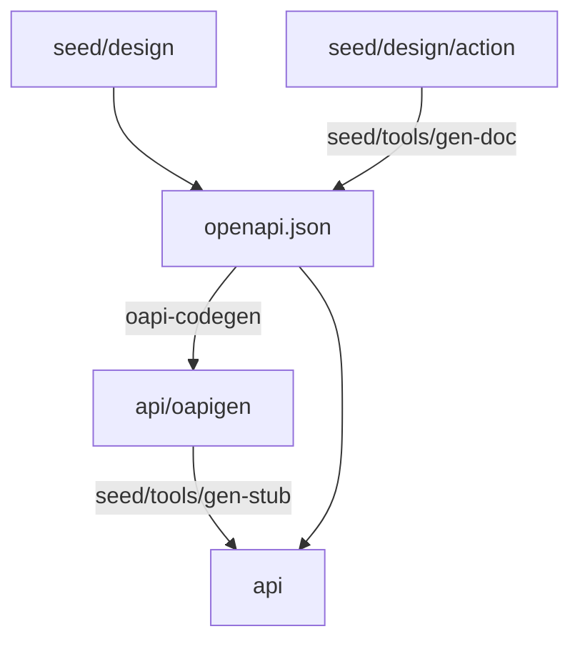

# emoji-api
emoji api server (sample project for go)

## code generation flow

```console
$ make
```


```mermaid
flowchart TD
  seed/design --> openapi.json
  seed/design/action -- seed/tools/gen-doc --> openapi.json
  openapi.json -- oapi-codegen --> api/oapigen
  api/oapigen -- seed/tools/gen-stub --> api
  openapi.json --> api
```
